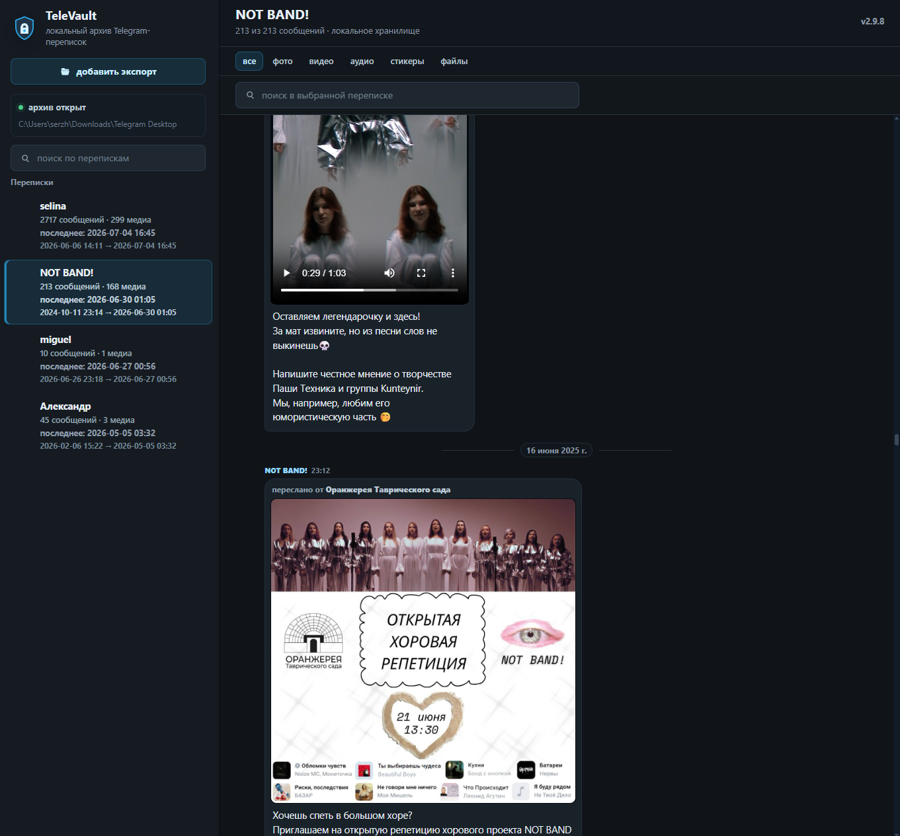
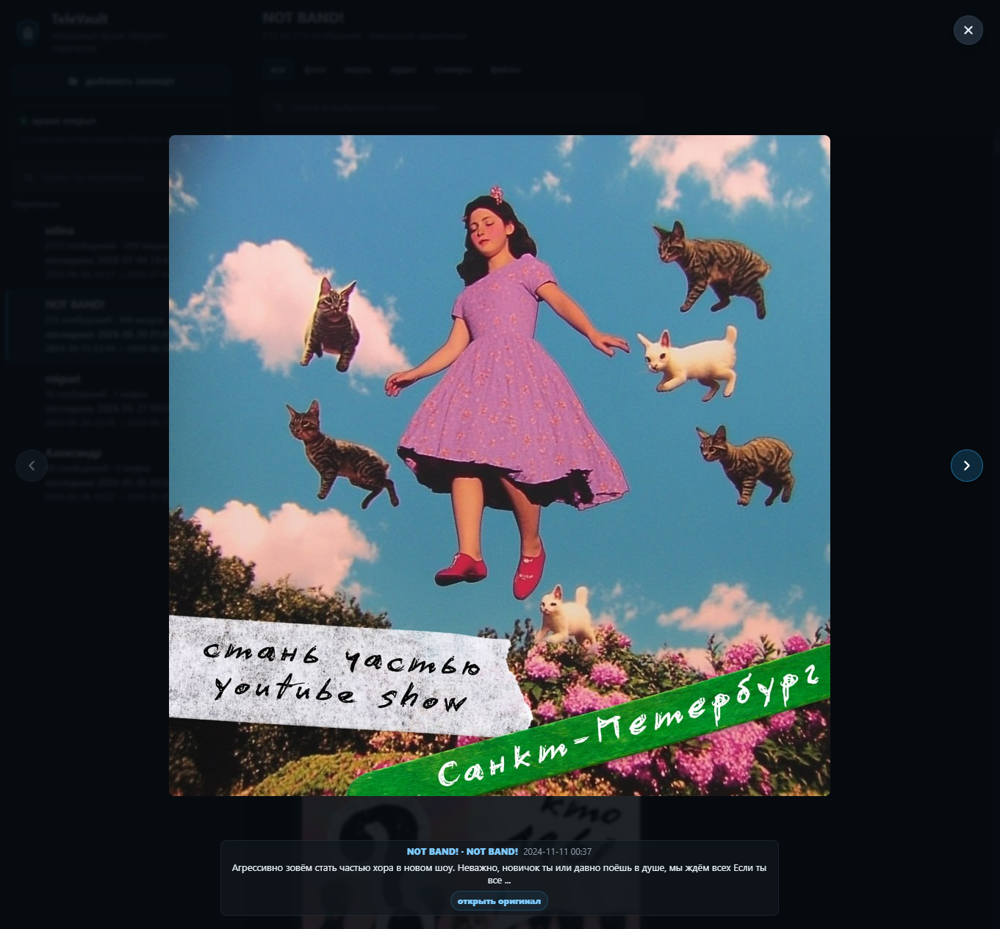

# TeleVault

Local offline archive for important Telegram chats.

TeleVault lets you add Telegram Desktop exports to a local library and browse saved conversations offline, including messages, photos, videos, voice messages, audio and files.

## Screenshots

## Features

- add Telegram Desktop export folders to a local library
- browse saved chats offline
- read messages in a cleaner interface
- view photos, videos, voice/audio and files
- search inside a conversation
- portable Windows app: unzip and run `TeleVault.exe`

## Privacy / Local-First

- no cloud account
- no Telegram login
- no bot token
- no sync
- your exports stay on your computer
- works with local Telegram Desktop export folders

## Download And Run

1. Download the latest Windows zip from [GitHub Releases](https://github.com/serzhberdnyk/televault/releases).
2. Unzip it to a folder.
3. Run `TeleVault.exe`.
4. Choose a Telegram export folder, or a parent folder that contains several exports.
5. Open a chat from the local library.

You do not need to install Python, Git, or developer tools for the portable Windows package.

## Windows Startup Notes

- If Windows SmartScreen warns about the unsigned portable exe, use it only when you downloaded TeleVault from the expected GitHub release.
- If `TeleVault.exe` does not open, run `run_windows.bat` from the same folder.
- If the browser does not open automatically, open `http://127.0.0.1:8766`.
- If the launcher reports an error, check `logs\launcher.log` next to the app. If that folder is not writable, diagnostics are written to `%LOCALAPPDATA%\TeleVault\logs\launcher.log`.
- Always unzip the full package before running the app.

## Supported Platforms

- Main package: Windows 10/11 x64.
- Windows 7: legacy / best effort only if a separate legacy package is published and tested. The main Windows 10/11 package does not support Windows 7. Do not download missing system DLLs such as `api-ms-win-core-path-l1-1-0.dll` from random DLL websites.

## Limitations

- works with exported Telegram data, not live Telegram sync
- does not log in to Telegram
- does not restore deleted Telegram cloud messages
- does not upload or back up chats online

## Feedback

Use [GitHub Issues](https://github.com/serzhberdnyk/televault/issues) for bugs and feedback.

When reporting a bug, include the TeleVault version, Windows version, export type if safe, and what happened.

## More

- [CHANGELOG.md](CHANGELOG.md) - release history
- [docs/release/RELEASE_CHECKLIST.md](docs/release/RELEASE_CHECKLIST.md) - release checks
- [docs/dev/DEVELOPMENT_LOG.md](docs/dev/DEVELOPMENT_LOG.md) - development notes
