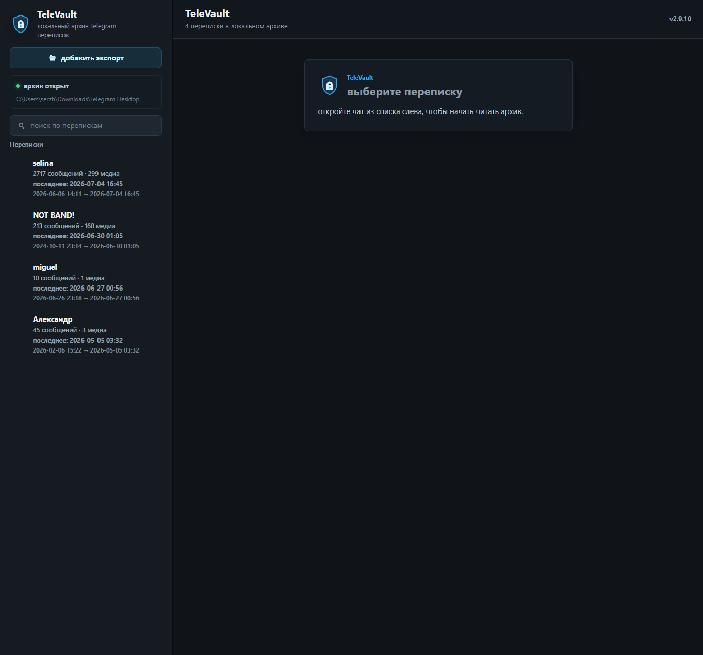
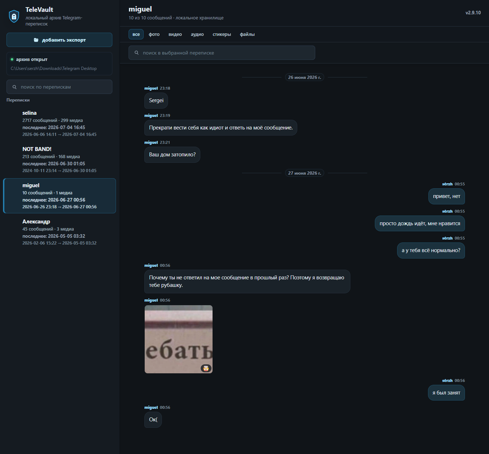
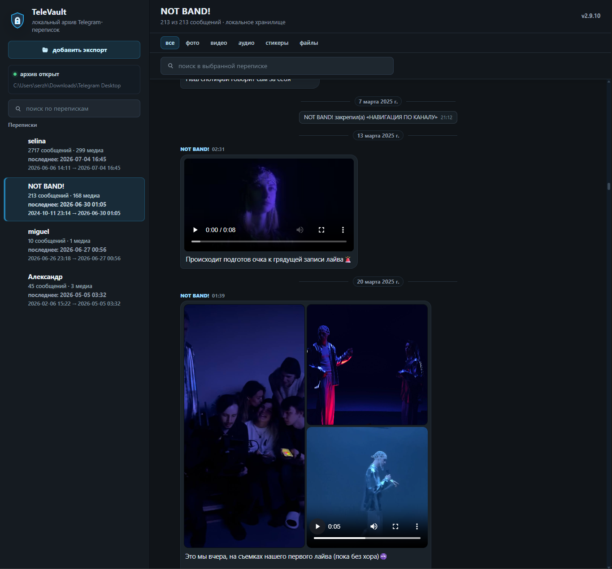

# TeleVault

TeleVault — локальный оффлайн-архив Telegram-переписок для Windows.

выберите папку экспорта Telegram Desktop, добавьте её в библиотеку и спокойно читайте сообщения, фото, видео, голосовые, аудио и файлы без интернета.

TeleVault не подключается к Telegram, не требует входа в аккаунт и не синхронизирует данные с облаком. всё хранится локально на вашем компьютере.

---

## зачем это нужно

Telegram Desktop умеет экспортировать переписки, но читать такие экспорты напрямую неудобно: сообщения, медиа и файлы лежат как архив, а не как спокойная библиотека для чтения.

TeleVault делает экспорт удобным локальным архивом:

- добавляете один или несколько экспортов;
- выбираете переписку;
- читаете сообщения в удобном виде;
- открываете фото, видео, голосовые, аудио и файлы;
- ищете нужное внутри выбранной переписки.

основная формула простая:

> открыть папку экспорта → добавить в библиотеку → читать переписки и медиа оффлайн

---

## скриншоты

### библиотека экспортов и выбор переписки

### чтение переписки

### просмотр медиа в полноэкранном режиме

### медиа внутри переписки

---

## что умеет

- открывать экспорты Telegram Desktop;
- хранить несколько экспортов в локальной библиотеке;
- открывать фото и изображения;
- воспроизводить видео;
- воспроизводить голосовые и аудио;
- ставить предыдущее медиа на паузу при запуске другого;
- показывать файлы и документы;
- показывать пересланные сообщения, системные сообщения от телеграм и прочие важные мелочи;
- искать внутри выбранной переписки;
- работать оффлайн после добавления экспорта.

---

## приватность

TeleVault сделан как local-first приложение.

- всё хранится на вашем компьютере;
- нет Telegram login;
- нет cloud/sync;
- нет отправки переписок на сервер;
- нет аккаунтов пользователей;
- нет AI-обработки сообщений;
- приложение работает с уже готовыми Telegram Desktop exports.

вы сами выбираете, какие экспорты добавить в библиотеку и где они лежат.

---

## как начать

1. экспортируйте нужные данные через Telegram Desktop;
2. скачайте portable zip из раздела Releases;
3. распакуйте архив в удобную папку;
4. запустите `TeleVault.exe`;
5. нажмите `добавить экспорт`;
6. выберите папку экспорта Telegram Desktop;
7. откройте переписку и читайте архив.

установка не нужна: portable-версия запускается прямо из распакованной папки.

---

## платформы

основной сценарий:

- Windows 10;
- Windows 11;
- portable zip;
- запуск через `TeleVault.exe`.

---

## ограничения

TeleVault — это не Telegram-клиент.

приложение:

- не выполняет вход в Telegram;
- не синхронизируется с Telegram;
- не получает новые сообщения;
- не отправляет сообщения;
- не работает с bot token;
- не является облачным хранилищем;
- не заменяет Telegram Desktop.

TeleVault читает локальные Telegram Desktop exports, которые уже находятся на вашем компьютере.

---

## english

TeleVault is a local offline reader for Telegram Desktop exports.

add an exported Telegram folder to your local library, open a chat, and read messages, photos, videos, voice messages, audio and files without internet access.

TeleVault is not a Telegram client. it does not require Telegram login, does not sync with Telegram and does not upload your data to the cloud. your archive stays on your computer.
